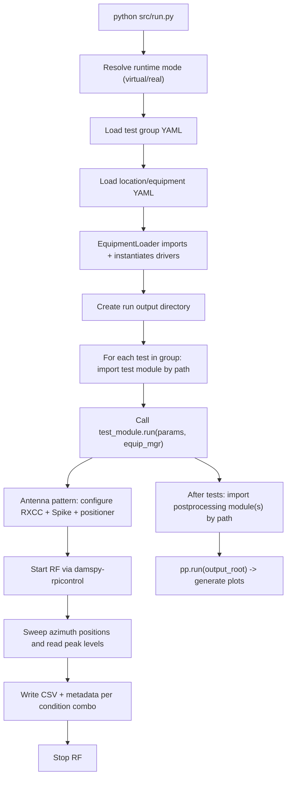

# Architecture

## Content
# DAMspy-core Architecture

## Executive summary

DAMspy-core is a **configuration-driven measurement orchestration system** implemented in Python. Its current “mainline” execution path is **`src/run.py`**, which selects a test group, loads the required lab equipment drivers, runs one or more measurement scripts, and then optionally runs group-level post-processing. fileciteturn59file0 fileciteturn69file0

The system is purpose-built for laboratory RF/EMC workflows, with the **primary implemented focus currently on antenna pattern measurement**, while additional workflows (e.g., emissions measurement) exist in the repo and are executed through the same runner when selected by configuration. fileciteturn69file0 fileciteturn58file0 fileciteturn57file0 fileciteturn74file0

DAMspy-core integrates with lab instruments using a mixture of **serial control**, **SCPI over TCP sockets**, and an external **HTTP/JSON control service** called `damspy-rpicontrol` (used to control an RXCC RF source). fileciteturn65file0 fileciteturn68file0 fileciteturn67file0 fileciteturn66file0 fileciteturn55file0

This document describes **what exists now and how the code works**, emphasizing major components, boundaries, and data flow (per the embedded architecture guidelines). fileciteturn54file0

## System scope

DAMspy-core’s scope is the **“operational core”**: it coordinates test execution, equipment initialization, run folder creation, and artifact generation for measurement workflows. fileciteturn69file0

A key operating characteristic is a **safety gate**: unless a local opt-in file indicates “real” mode, the runner will not proceed to equipment initialization. This reflects the system’s assumption that **if devices/services are not present, the system cannot perform a measurement run**. fileciteturn71file0 fileciteturn59file0

The architecture is intentionally **workflow-oriented**: “tests” are Python scripts that implement a `run(params, equip)` entrypoint and encapsulate measurement logic (including manual operator prompts where required). fileciteturn59file0 fileciteturn57file0 fileciteturn74file0

In addition to the main workflow runner, the repo contains **standalone or ad-hoc hardware smoketest scripts** intended for quick system checks; these are not conceptually the core “measurement workflow pipeline,” even though they live alongside the grouped test methods. fileciteturn58file0 fileciteturn72file0 fileciteturn73file0

## DAMSpy ecosystem boundaries

DAMspy-core is the execution and runtime-truth repository within the wider DAMspy ecosystem.

Its primary responsibility is to run measurement workflows, coordinate equipment, and produce run artefacts. It is also the natural owner of current runtime state describing what the system is doing during an active run.

Adjacent DAMSpy repositories are expected to have separate responsibilities:

- **damspy-rpicontrol** provides external hardware control services over HTTP/JSON where that control is intentionally separated from the main runner process
- **damspy-vc** consumes runtime state produced by damspy-core and renders operator-facing views, including a richer internal desk view and a phone-friendly mobile view
- **damspy.com** may later act as a simple external presentation layer for selected published DAMSpy viewer artefacts, without becoming the source of operational truth

The intended state flow is:

1. damspy-core writes current runtime state locally in a machine-readable WOYM-style form
2. damspy-vc lives on the same compute that damspy-core is on and it reads that state and renders local operator views as webserved html, accessable over lan .
3. damspy-vc may publish a reduced outward-facing artefact, such as a mobile status image to vercel blob
4. damspy.com living on vercel may display that published mobile image on the domain damspy.com  (this would be a later phase)

This keeps responsibilities clear:

- **damspy-core** owns execution and runtime truth
- **damspy-vc** owns presentation
- **damspy.com** owns external display of already-published artefacts

Under this model, damspy-core should not become the long-term home of rich operator UI concerns, while damspy-vc should not become the source of measurement-state truth.


## Component architecture

At a high level, DAMspy-core is organized into these major components (folders reflect the repo’s current structure). fileciteturn69file0

### Orchestrator

**`src/run.py`** is the orchestration entrypoint and defines the system’s “runtime contract”:

- Loads group-level configuration (`test_group_run_config.yaml`)
- Loads location/equipment configuration (`location_config.yaml`)
- Instantiates the required equipment drivers via `EquipmentLoader`
- Imports test modules by file path (to allow filenames beginning with digits)
- Calls each test’s `run()` function with `{params, equip_mgr}`
- Runs group-level post-processing scripts (also imported by path) fileciteturn59file0

A representative excerpt showing the dynamic import approach:

```python
spec = importlib.util.spec_from_file_location(mod_name, str(py_path))
module = importlib.util.module_from_spec(spec)
spec.loader.exec_module(module)
```

fileciteturn59file0 citeturn0search2

### Configuration model

The runner is driven by two YAML layers:

- **Test-group selection and composition**: `src/config/test_group_run_config.yaml` defines the current group plus its required equipment, test list, and post-processing list. fileciteturn58file0  
- **Lab location + device drivers**: `src/config/location_config.yaml` selects an active location and defines equipment categories (positioner, spectrum analyzer, signal generator) with per-device connection settings and driver class/module paths. fileciteturn65file0

YAML parsing is performed with PyYAML’s safe loader. fileciteturn59file0 citeturn0search0

### Equipment integration layer

The **`EquipmentLoader`** is a lightweight runtime composition mechanism: it reads `location_config.yaml`, selects only the required equipment for the chosen test group, and dynamically imports/instantiates driver classes. fileciteturn64file0 fileciteturn65file0

A representative excerpt that shows how driver modules are resolved:

```python
module_path = cfg["driver"].replace("/", ".").replace(".py", "")
module = importlib.import_module(module_path)
cls = getattr(module, cfg["class_name"])
return cls(cfg)
```

fileciteturn64file0

A practical architectural detail: the loader exposes devices as attributes like `equip.positioner`, `equip.spectrum_analyser`, and `equip.signal_generator`. For multi-device categories, it may set either a dict or “flatten” to a single object if only one is loaded. fileciteturn64file0

### Driver base abstractions

The repo includes permissive driver base classes in `src/equipment/utils/driver_base.py` intended to standardize lifecycle (`open/close`) and RF control (`rf_on/rf_off`) at a conceptual level. fileciteturn63file0

Not all drivers in the repo currently inherit from these bases, but one key driver does: the RXCC driver inherits from `SignalGeneratorBase`. fileciteturn66file0 fileciteturn63file0

## Configuration and execution model

DAMspy-core’s execution behavior is primarily determined by configuration, with a small number of runtime conventions.

### Test group selection

`src/config/test_group_run_config.yaml` names a single active group:

- `current_test_group: Antenna_Pattern_Measurement` fileciteturn58file0

Each group typically contains:

- `required_equipment`: a list of equipment categories or specific devices (e.g., `signal_generator.sig_gen_1`)
- `tests`: a list of test method script basenames
- `test_postprocessing`: optional post-processing scripts to run after tests fileciteturn58file0

### Location binding and driver instantiation

`src/config/location_config.yaml` binds logical equipment roles to concrete drivers. For the current location example:

- Positioner: `equipment/positioner/Diamond_D6050.py` on `COM3`
- Spectrum analyzer control: `equipment/spectrum_analyser/BBD60_Spike.py` talking to `127.0.0.1:5025`
- Signal generator (RXCC): `equipment/signal_generator/rxcc.py` configured to call `http://10.0.1.195:8000` fileciteturn65file0

This is where DAMspy-core declares its expectations about the lab environment and external services/devices. fileciteturn65file0

### Output directory convention and shared runtime context

`src/run.py` creates a single top-level output directory for an entire run, then passes that same `output_dir` to every test in the group. It derives the DUT name from the first test’s YAML and appends it to the run folder name. It also copies referenced “antenna factor” and “path loss” files into the run root once per run. fileciteturn59file0

This establishes the architectural rule that **tests are coordinated within a single run folder**, which becomes the primary unit of traceability and later analysis. fileciteturn59file0 fileciteturn69file0

A note on packaging: the repo is currently operated as a source tree without a pinned dependency manifest (no `requirements.txt` / `pyproject.toml` is used as the authoritative dependency lock). This is an observation about the repo’s operational posture rather than a design recommendation. fileciteturn69file0

## Antenna pattern measurement workflow

The currently selected and most prominent workflow is **Antenna Pattern Measurement**, implemented as a measurement script plus a post-processing script. fileciteturn58file0

### Execution flow

The workflow is structured as:

- Orchestrator loads config and equipment
- Test method performs sweep(s), collecting peak measurements
- Outputs are written as CSV + JSON metadata (and later plotted)
- Group-level post-processing creates a polar plot image fileciteturn59file0 fileciteturn57file0 fileciteturn56file0

Mermaid flow diagram of the implemented control flow:



fileciteturn59file0 fileciteturn64file0 fileciteturn57file0 fileciteturn66file0 fileciteturn56file0

### Measurement script responsibilities

The antenna pattern measurement script (`src/test_methods/Antenna_Pattern_Measurement/1_meas_azimuth.py`) implements an azimuth sweep with:

- an **outer manual loop** for polarization changes (the operator is prompted to reconfigure the setup)
- automated inner loops across RXCC parameters (antenna / channel / power)
- one output folder per condition combination, producing:
  - `pattern_azimuth.csv` (azimuth_deg, rx_peak_dbm, peak_freq_hz)
  - `metadata.json` describing the condition and capture parameters fileciteturn57file0

The script treats the RXCC as a “channelized” RF source and translates channel → frequency using a 2.4 GHz + 0.5 MHz/channel mapping for downstream tuning of the spectrum analyzer. fileciteturn57file0

### Post-processing responsibilities

The antenna pattern post-processing script (`src/test_postprocessing/Antenna_Pattern_Measurement/1_azimuth_polar_plot.py`) reads the measurement CSV and generates a polar plot image (`pattern_azimuth_EEmax.png`) using a linear E/Emax normalization and reference rings. fileciteturn56file0

The post-processing contract is standardized as:

- `run(run_dir: str)` and “no hardware interaction; safe to re-run on archived data.” fileciteturn56file0

## External interfaces

DAMspy-core’s architecture explicitly spans multiple system boundaries: local Python process, instrument control endpoints, and at least one external service.

### damspy-rpicontrol HTTP/JSON service for RXCC control

The RXCC “signal generator” in DAMspy-core is implemented as an adapter driver (`RXCC`) backed by the external `damspy-rpicontrol` service. The service contract is documented as an OpenAPI-capable HTTP API:

- Base URL: `http://<pi-ip>:8000`
- `/docs` (Swagger UI) and `/openapi.json` endpoints are referenced as the machine-readable contract surface. fileciteturn55file0 citeturn1search3turn1search0

The authoritative endpoint contract includes:

- `GET /health`
- `POST /api/rf/start` with JSON body `{antenna, channel, power}`
- `POST /api/rf/stop` fileciteturn55file0

The DAMspy-core driver uses the Python standard library (`urllib.request`) to call these endpoints and intentionally models RXCC constraints (channel 0..80, power 0..10, antenna main/secondary) rather than pretending to be an arbitrary-frequency RF synthesizer. fileciteturn66file0

This service is typically hosted on a Raspberry Pi on the lab LAN; the reference contract describes the canonical “typical base IP” used in the current environment. fileciteturn55file0

(Where GPIO-level control is relevant inside the service implementation, Raspberry Pi’s ecosystem commonly relies on libraries such as GPIO Zero or RPi.GPIO; this is outside damspy-core but frames the hardware control context.) citeturn2search0turn2search2

### Spectrum analyzer control via Spike + SCPI over TCP

The spectrum analyzer driver (`BB60Spike`) uses a raw TCP socket connection and issues SCPI commands (e.g., `:FREQ:CENT`, `:FREQ:SPAN`, `:TRAC:DATA?`). fileciteturn67file0

The repo’s default configuration binds this to `127.0.0.1:5025`. fileciteturn65file0

This aligns with the documented Spike behavior from entity["company","Signal Hound","rf test equipment vendor"]: Spike provides a SCPI TCP socket (default port 5025) for remote control/automation. fileciteturn67file0 citeturn3search47turn3search1

### Positioner control via serial

The positioner driver (`DiamondD6050`) uses the `serial` module (pySerial) to send command strings to a configured COM port and read back encoder data. fileciteturn68file0

pySerial is the standard cross-platform Python library for serial port access and provides the `serial` module abstraction used by the driver. fileciteturn68file0 citeturn1search2

## Outputs and post-processing

DAMspy-core’s primary persistent interface is the **run folder** (file system artifacts). This is the unit of record for operators and later analysis. fileciteturn69file0

### Run folder as an artifact boundary

`src/run.py` creates a run folder of the form:

- `src/DAMspy_logs/<test_group>_<timestamp>_<DUT>` fileciteturn59file0

The runner then:

- passes `output_dir` into each test via `params["output_dir"]`
- copies calibration/reference inputs (antenna factor, path loss) into the run root (once per run) fileciteturn59file0

### Data formats

Across workflows, the repo consistently uses:

- **CSV** for numeric measurement traces (e.g., azimuth sweep points, max-hold traces) fileciteturn57file0turn74file0
- **JSON** for metadata artifacts that describe the run conditions and measurement settings fileciteturn57file0turn74file0
- **PNG images** for derived plots (matplotlib output), especially in post-processing or instrument trace plotting helpers fileciteturn56file0turn67file0

### Post-processing as a group-level phase

Post-processing is modeled as an optional group-level phase in `test_group_run_config.yaml` and is executed after tests complete. Each post-processing module is imported by path and expected to expose a `run(run_dir: str)` function. fileciteturn58file0turn59file0

## Technology stack and repository layout

### Primary implementation technology

- Python is the execution environment; DAMspy-core’s orchestration uses dynamic import-by-filepath for tests and post-processing. fileciteturn59file0 citeturn0search2
- YAML is used for configuration, parsed via PyYAML (`yaml.safe_load`). fileciteturn59file0 citeturn0search0
- HTTP/JSON service integration (RXCC via damspy-rpicontrol) is implemented with Python stdlib networking (`urllib.request`) and follows an OpenAPI-described contract. fileciteturn66file0turn55file0 citeturn1search0turn1search3
- Instrument automation uses:
  - raw TCP sockets + SCPI for Spike control (port 5025 by default) fileciteturn67file0 citeturn3search47turn3search1
  - serial control for the Diamond D6050 positioner (pySerial) fileciteturn68file0 citeturn1search2
- Data analysis/visualization uses NumPy and Matplotlib (in drivers and post-processing scripts). fileciteturn67file0turn56file0

### Repository layout as currently implemented

The repo’s own description summarizes the active structure:

- `src/` operational codebase and execution path
- `config/` runtime and test configuration
- `reference/` high-authority interface notes (e.g., rpicontrol contract quickstart)
- `docs/` backfilled documentation for existing working behavior fileciteturn69file0turn70file0turn55file0

The overall architectural intent, as documented in the repository, is that damspy-core remains focused on measurement execution/orchestration, while adjacent operator interfaces or control GUIs are treated as separate concerns. fileciteturn69file0

### Standalone and legacy-adjacent test scripts

Within `src/test_methods/Hardware_Smoketests`, there are scripts that act as direct device sanity checks (e.g., “turn RF on and dwell”, “read a peak”); they contain their own driver-picking logic and a different calling convention than the main `run.py` workflow contract. fileciteturn72file0turn73file0

This co-existence reflects the repo’s role as an operational system with both workflow-level measurement methods and pragmatic standalone checks. fileciteturn69file0

---

## Editing Guidelines (Do Not Modify Below This Line)

This document describes the **high-level structure of the system**.

Focus on **system design and component relationships**, not implementation details.

Explain the **high-level structure of the system**.

Typical things described here include:

• major system components
• how components interact
• data flow through the system
• external services or integrations

Architecture diagrams or simple flow descriptions may be included.

When updating this document:

• describe major components and responsibilities
• describe how components communicate
• describe important system boundaries

Avoid including:

• detailed implementation logic
• step-by-step engineering tasks
• testing instructions

Engineering work and task tracking belong in `liveplan.md`.

Only edit the **Content section above** unless the documentation system itself is being changed.
